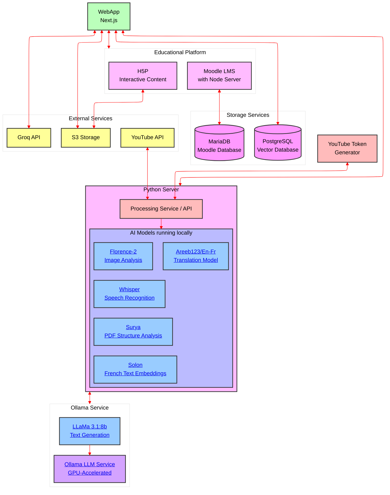

# Science Infuse
Le projet [Science Infuse](https://science-infuse.beta.gouv.fr/) a pour but d'accompagner le corps enseignant dans la création de contenus pédagogiques scientifiques


## Installation et utilisation
This monorepo is managed by docker compose, have it installed and run 
```
docker compose up --build
```
then open your favorite web browser and go to [http://localhost:3000](http://localhost:3000)

### postgres

using postgres as a SQL database, and as a vector database using pgvector

since vector is not supported by prisma, we need to do things behind his back...
to prevent prisma drift, we have to remove index (which are not supported for vectors) before doing the db migration and re-crate them after the migration with this command:
```
SET maintenance_work_mem TO '2GB';
CREATE INDEX idx_document_chunk_text_embedding 
ON "DocumentChunk" USING hnsw ("textEmbedding" vector_cosine_ops)
WITH (m = 16, ef_construction = 64);
```


### webapp
A NextJS client to query the database

### server *
TODO: becomes processing
A Python3 / FastAPI server to handle database queries


### ftp_processing *
A Python3 script that listens to file writes in `ftp-data` (see ftp section), and index them using Machine Learning technics.

### ftp
A ftp server that write files to `ftp-data`

**\*** These services use the same Docker image, but with different entry points.

