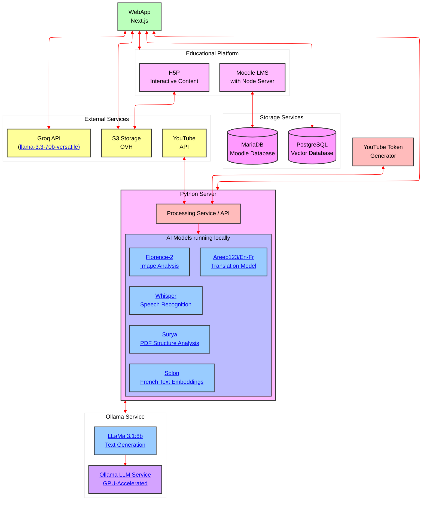

# Science Infuse
Le projet [Science Infuse](https://science-infuse.beta.gouv.fr/) a pour but d'accompagner le corps enseignant dans la création de contenus pédagogiques scientifiques


## Installation et utilisation
This monorepo is managed by docker compose, have it installed and run 
```
docker compose up --build
```
then open your favorite web browser and go to [http://localhost:3000](http://localhost:3000)
